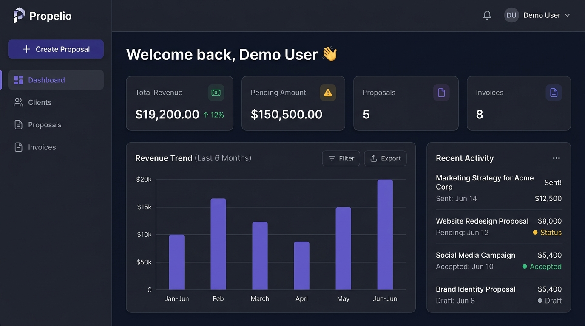
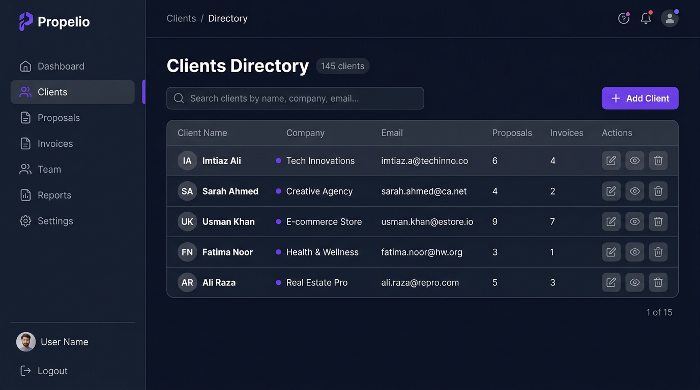
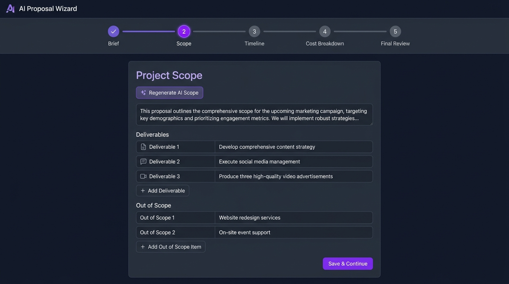
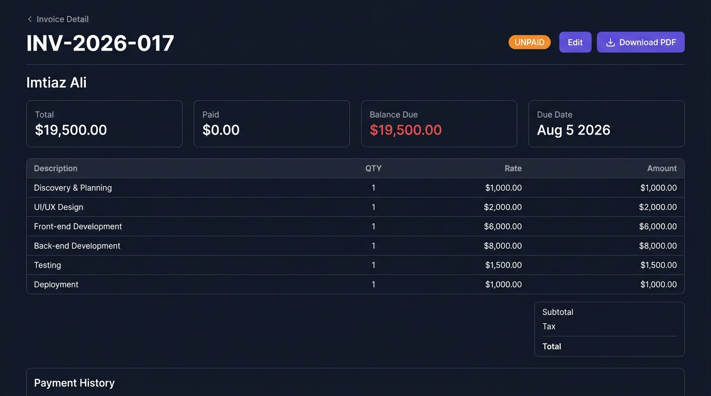

<div align="center">


# ✨ Propelio — AI-Powered Client Proposal & Invoice Generator

**The complete agency management platform. Generate professional proposals with AI, manage clients, create invoices, and track payments — all in one sleek dashboard.**

[](https://laravel.com)
[](https://vuejs.org)
[](https://tailwindcss.com)
[](https://deepmind.google/technologies/gemini/)
[](https://groq.com)
[](https://opensource.org/licenses/MIT)

[🚀 Features](#-features) · [📸 Screenshots](#-screenshots) · [🛠️ Tech Stack](#️-tech-stack) · [⚡ Quick Start](#-quick-start) · [📡 API Reference](#-api-reference) · [🤝 Contributing](#-contributing)

</div>

---

## 🎯 Overview

**Propelio** is a full-stack SaaS-style application built for freelancers and digital agencies. It eliminates the manual effort of writing project proposals by using **Google Gemini AI** to intelligently generate project scope, timelines, and cost breakdowns from a simple client brief.

Once a proposal is approved, converting it into a professional invoice — complete with line items, payment tracking, and PDF export — takes just a few clicks.

> 💡 **Built with:** Laravel 12 (REST API) + Vue 3 (SPA) + Gemini 1.5 Flash (AI)

---

## ✨ Features

### 🤖 AI-Powered Proposal Engine
- **5-Step Wizard**: Brief → Scope → Timeline → Cost Breakdown → Final Review
- **Gemini 1.5 Flash** generates professional project scope (deliverables + out-of-scope items)
- **Groq AI** fallback for timeline & cost generation
- **Regenerate** any AI section instantly with one click
- Fully editable AI outputs — add, remove, or modify any field

### 📋 Proposal Management
- Create, edit, send, and track proposals
- Status lifecycle: `Draft → Sent → Accepted / Rejected`
- Convert accepted proposals directly into invoices
- Rich proposal history per client

### 🧾 Invoice Management
- Auto-populate invoice from proposal data
- Add/remove line items with real-time subtotal calculation
- Status tracking: `Unpaid → Partially Paid → Paid → Overdue`
- **Download PDF** — server-side rendered with DomPDF
- **Record Payments** with date and notes
- Cancel / Void invoices

### 👥 Client Management
- Full client directory with company, email, and contact details
- Per-client proposal and invoice history
- Quick-access counters on client list view

### 📊 Analytics Dashboard
- **Total Revenue** from recorded payments
- **Pending Amount** outstanding across all invoices
- **6-Month Revenue Trend** bar chart (Chart.js)
- **Recent Activity** feed — proposals and invoices at a glance
- Proposal status breakdown (Accepted, Sent, Draft)

### 🔐 Authentication & Security
- Laravel Sanctum cookie-based SPA authentication
- Route-level authorization with Laravel Policies
- CORS configured for SPA + API separation

---

## 📸 Screenshots

### 🏠 Dashboard
> Real-time agency overview with revenue metrics, cash flow trends, and recent activity.



---

### 👥 Clients Directory
> Manage all client accounts with proposal and invoice counts at a glance.



---

### 🧠 AI Proposal Wizard — Scope Generation
> Describe your project. Gemini AI generates the scope, deliverables, timeline, and cost breakdown.



---

### 🧾 Invoice Detail View
> Full invoice breakdown with payment history tracking and PDF download.



---

## 🛠️ Tech Stack

| Layer | Technology | Purpose |
|---|---|---|
| **Backend** | Laravel 12 | REST API, Business Logic, Auth |
| **Frontend** | Vue 3 + Vite | Single Page Application (SPA) |
| **State Management** | Pinia | Reactive global state |
| **Routing** | Vue Router 4 | Client-side routing |
| **Styling** | Tailwind CSS 4 | Utility-first UI styling |
| **Charts** | Chart.js | Revenue trend visualization |
| **AI — Scope & Timeline** | Google Gemini 1.5 Flash | AI proposal generation |
| **AI — Fallback** | Groq (LLaMA 3) | Fallback AI generation |
| **PDF Generation** | barryvdh/laravel-dompdf | Server-side PDF rendering |
| **Authentication** | Laravel Sanctum | SPA session-based auth |
| **Database** | MySQL | Relational data storage |
| **HTTP Client** | Axios | API communication |

---

## 📁 Project Structure

```
propelio/
├── app/
│   ├── Http/
│   │   ├── Controllers/
│   │   │   └── Api/
│   │   │       ├── AuthController.php
│   │   │       ├── ClientController.php
│   │   │       ├── DashboardController.php
│   │   │       ├── InvoiceController.php
│   │   │       ├── PaymentController.php
│   │   │       └── ProposalController.php
│   │   └── Requests/
│   ├── Models/
│   │   ├── Client.php
│   │   ├── Invoice.php
│   │   ├── InvoiceItem.php
│   │   ├── Payment.php
│   │   ├── Proposal.php
│   │   └── User.php
│   ├── Policies/
│   └── Services/
│       ├── GeminiService.php       ← Google Gemini AI integration
│       ├── GroqService.php         ← Groq AI fallback integration
│       ├── InvoicePdfService.php   ← PDF invoice generation
│       └── ProposalPdfService.php  ← PDF proposal generation
│
├── resources/js/
│   ├── views/
│   │   ├── Dashboard.vue
│   │   ├── auth/
│   │   ├── clients/
│   │   ├── proposals/
│   │   │   ├── ProposalList.vue
│   │   │   └── ProposalWizard.vue  ← 5-step AI wizard
│   │   └── invoices/
│   │       ├── InvoiceList.vue
│   │       ├── InvoiceForm.vue
│   │       └── InvoiceShow.vue
│   ├── components/
│   │   ├── layout/
│   │   ├── dashboard/
│   │   ├── proposals/
│   │   ├── invoices/
│   │   └── ui/
│   ├── stores/          ← Pinia stores
│   ├── composables/     ← Vue composables
│   ├── router/          ← Vue Router config
│   └── api/             ← Axios API layer
│
├── database/
│   └── migrations/      ← 12 migration files
│
└── screenshots/         ← App preview images
```

---

## ⚡ Quick Start

### Prerequisites

Make sure you have the following installed:

- **PHP** `>= 8.2`
- **Composer** `>= 2.x`
- **Node.js** `>= 18.x` & **npm**
- **MySQL** `>= 8.0`

### 1. Clone the Repository

```bash
git clone https://github.com/Imtiaz-Ali17314/Propelio---AI-Powered-Client-Proposal-Invoice-Generator.git
cd Propelio---AI-Powered-Client-Proposal-Invoice-Generator
```

### 2. Install Dependencies

```bash
# PHP dependencies
composer install

# Node dependencies
npm install
```

### 3. Environment Configuration

```bash
cp .env.example .env
php artisan key:generate
```

Now open `.env` and configure the following:

```env
# Database
DB_CONNECTION=mysql
DB_HOST=127.0.0.1
DB_PORT=3306
DB_DATABASE=propelio
DB_USERNAME=root
DB_PASSWORD=your_password

# AI Services (Required for AI features)
GEMINI_API_KEY=your_gemini_api_key_here
GROQ_API_KEY=your_groq_api_key_here

# App URL
APP_URL=http://localhost:8000
```

> 🔑 **Get your API Keys:**
> - **Gemini API Key** → [Google AI Studio](https://aistudio.google.com/app/apikey) (Free tier available)
> - **Groq API Key** → [Groq Console](https://console.groq.com/) (Free tier available)

### 4. Database Setup

```bash
# Create MySQL database first
mysql -u root -p -e "CREATE DATABASE propelio;"

# Run migrations
php artisan migrate
```

### 5. Run the Application

```bash
# Run everything concurrently (recommended)
composer dev
```

This starts:
- `php artisan serve` → Laravel API on `http://localhost:8000`
- `npm run dev` → Vite dev server on `http://localhost:5173`
- `php artisan queue:listen` → Background job worker
- `php artisan pail` → Log viewer

> 🌐 Open your browser at **`http://localhost:8000`**

---

### ⚡ One-Command Setup (Alternative)

```bash
composer setup
```

This will automatically: install dependencies → generate app key → run migrations → build frontend assets.

---

## 📡 API Reference

All API endpoints are prefixed with `/api` and protected via **Laravel Sanctum** (except auth routes).

### 🔐 Authentication

| Method | Endpoint | Description |
|--------|----------|-------------|
| `POST` | `/api/auth/register` | Register new user |
| `POST` | `/api/auth/login` | Login & get session cookie |
| `POST` | `/api/auth/logout` | Logout & invalidate session |
| `GET` | `/api/auth/user` | Get authenticated user |

### 👥 Clients

| Method | Endpoint | Description |
|--------|----------|-------------|
| `GET` | `/api/clients` | List all clients |
| `POST` | `/api/clients` | Create new client |
| `GET` | `/api/clients/{id}` | Get client details |
| `PUT` | `/api/clients/{id}` | Update client |
| `DELETE` | `/api/clients/{id}` | Delete client |

### 📋 Proposals

| Method | Endpoint | Description |
|--------|----------|-------------|
| `GET` | `/api/proposals` | List all proposals |
| `POST` | `/api/proposals` | Create new proposal (with AI) |
| `GET` | `/api/proposals/{id}` | Get proposal detail |
| `PUT` | `/api/proposals/{id}` | Update proposal |
| `DELETE` | `/api/proposals/{id}` | Delete proposal |
| `POST` | `/api/proposals/{id}/generate-scope` | 🤖 AI: Generate scope |
| `POST` | `/api/proposals/{id}/generate-timeline` | 🤖 AI: Generate timeline |
| `POST` | `/api/proposals/{id}/generate-cost` | 🤖 AI: Generate cost breakdown |
| `POST` | `/api/proposals/{id}/send` | Mark proposal as sent |
| `GET` | `/api/proposals/{id}/pdf` | Download proposal PDF |

### 🧾 Invoices

| Method | Endpoint | Description |
|--------|----------|-------------|
| `GET` | `/api/invoices` | List all invoices |
| `POST` | `/api/invoices` | Create new invoice |
| `GET` | `/api/invoices/{id}` | Get invoice detail |
| `PUT` | `/api/invoices/{id}` | Update invoice |
| `DELETE` | `/api/invoices/{id}` | Delete invoice |
| `POST` | `/api/invoices/{id}/void` | Void/cancel invoice |
| `GET` | `/api/invoices/{id}/pdf` | Download invoice PDF |

### 💳 Payments

| Method | Endpoint | Description |
|--------|----------|-------------|
| `POST` | `/api/invoices/{id}/payments` | Record a payment |
| `DELETE` | `/api/invoices/{invoice}/payments/{payment}` | Delete a payment |

### 📊 Dashboard

| Method | Endpoint | Description |
|--------|----------|-------------|
| `GET` | `/api/dashboard` | Get all dashboard metrics |

---

## 🗄️ Database Schema

```
users
  └── clients (user_id)
        ├── proposals (client_id, user_id)
        └── invoices (client_id, user_id)
              ├── invoice_items (invoice_id)
              └── payments (invoice_id)
```

**Key Models:**

| Model | Key Fields |
|-------|-----------|
| `User` | name, email, password |
| `Client` | name, company, email, phone |
| `Proposal` | client_id, title, brief, status, ai_scope, ai_timeline, ai_cost |
| `Invoice` | client_id, invoice_number, status, due_date, tax_percent |
| `InvoiceItem` | invoice_id, description, qty, rate, amount |
| `Payment` | invoice_id, amount, payment_date, notes |

---

## 🤖 AI Integration Details

Propelio uses a **dual AI provider** strategy:

### Google Gemini 1.5 Flash
Used for generating the **Project Scope** step:
- Project overview summary
- Deliverables list
- Out-of-scope items

```php
// app/Services/GeminiService.php
$gemini->generateScope($clientBrief);    // Step 2: Scope
$gemini->generateTimeline($brief, $scope); // Step 3: Timeline
$gemini->generateCostBreakdown(...);     // Step 4: Cost
```

### Groq (LLaMA 3)
Serves as the **fallback AI provider** via `GroqService.php`, ensuring the proposal wizard always works even if one provider is down.

### Prompt Engineering
All AI responses are forced into **strict JSON format** using:
- Structured prompt templates with exact schema definitions
- `responseMimeType: application/json` for Gemini
- Server-side JSON validation with error handling

---

## 🏗️ Architecture

```
┌─────────────────────────────────────────────────┐
│                   Browser (SPA)                  │
│         Vue 3 + Pinia + Vue Router               │
│              Tailwind CSS 4                      │
└──────────────────┬──────────────────────────────┘
                   │ Axios HTTP (Cookie Auth)
┌──────────────────▼──────────────────────────────┐
│              Laravel 12 REST API                  │
│    Sanctum Auth  │  Policies  │  Controllers     │
│              Service Layer                        │
│   GeminiService  │  GroqService  │  PdfService   │
└──────┬───────────┬────────────────────────┬──────┘
       │           │                        │
┌──────▼──┐  ┌─────▼──────┐  ┌─────────────▼────┐
│  MySQL  │  │ Gemini API │  │    Groq API       │
│   DB    │  │  (Google)  │  │  (LLaMA 3)        │
└─────────┘  └────────────┘  └──────────────────┘
```

---

## ⚙️ Configuration

### Queue (for background jobs)

```bash
# Ensure queue is running for any background processing
php artisan queue:work
```

### Session & CORS

The `.env` is pre-configured for local development. For production, update:

```env
APP_ENV=production
APP_DEBUG=false
APP_URL=https://yourdomain.com
SANCTUM_STATEFUL_DOMAINS=yourdomain.com
CORS_ALLOWED_ORIGINS=https://yourdomain.com
```

---

## 🧪 Running Tests

```bash
# Run all tests
composer test

# Or directly with PHPUnit
php artisan test
```

---

## 🚀 Deployment Checklist

- [ ] Set `APP_ENV=production` and `APP_DEBUG=false`
- [ ] Configure production database credentials
- [ ] Add real `GEMINI_API_KEY` and `GROQ_API_KEY`
- [ ] Run `composer install --no-dev --optimize-autoloader`
- [ ] Run `npm run build`
- [ ] Run `php artisan config:cache && php artisan route:cache`
- [ ] Set up a queue worker (Supervisor recommended)
- [ ] Configure web server (Nginx/Apache) to point to `/public`

---

## 🤝 Contributing

Contributions are welcome! Here's how to get started:

1. **Fork** the repository
2. **Create** a feature branch: `git checkout -b feature/amazing-feature`
3. **Commit** your changes: `git commit -m 'feat: add amazing feature'`
4. **Push** to the branch: `git push origin feature/amazing-feature`
5. **Open** a Pull Request

Please follow [Conventional Commits](https://www.conventionalcommits.org/) for commit messages.

---

## 📄 License

This project is licensed under the **MIT License** — see the [LICENSE](LICENSE) file for details.

---

## 👨‍💻 Author

<div align="center">

**Imtiaz Ali**

[](https://github.com/Imtiaz-Ali17314)

*Built with ❤️ using Laravel, Vue 3, and the power of AI*

</div>

---

<div align="center">

⭐ **If you found this project useful, please give it a star!** ⭐

</div>

